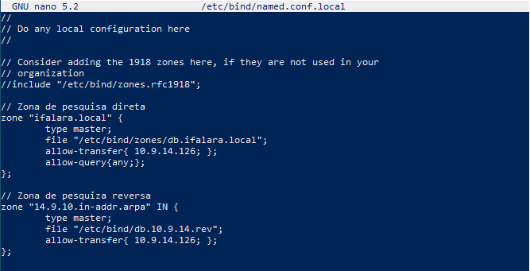

# Instituto Federal de Alagoas - Campus Arapiraca
### Prof. Alaelson Jatobá

### Alunos Turma 914: 
 - Bruno Martins Santos
 - Elias José Lima da Silva 
 - Filipe Alves de Souza
 - Pedro Carlos Ormindo da Silva

---
## Sumário

## 1. Introdução

## 2. Definições Iniciais

## 3. Implementação dos Serivços de Rede (Cada serviço uma sessão)

## Considerações Finais

---

# Introdução
Texto deintrodução

# Definições Iniciais

### CONFIGURAÇÕES DAS INTEFACES DE REDE

| Rede | IP Externo | Mascara | IP Interno | Mascara |
| --- | --- | --- | --- | --- |
| IP da Subrede: | 10.9.14.0 | /24 | 192.168.14.24 | /29 |
| IP de Broadcast: | 10.9.14.255/24 | /24 | 192.168.14.31	| /29 |

| Nome da VMs | WAN | IP | LAN | IP |
| --- | --- | --- | --- | --- |
| IP do GW: | ens160 | 10.9.14.108 | ens192 |	192.168.14.25 |
| IP do SAMBA: | ens160 | 10.9.14.103 | ens192 |	192.168.14.26 |
| IP do NS1: | ens160 | 10.9.14.126 | ens192 |	192.168.14.27 |
| IP do NS2: | ens160 | 10.9.14.109 | ens192 |	192.168.14.28 |
| IP do WEB | ens160 | 10.9.14.xxx | ens192 |	192.168.14.29 |
| IP do BD | ens160 | 10.9.14.xxx | ens192 |	192.168.14.30 |

### DEFINIÇÂO DE NOMES E DOMÍNIO (grupo4.turma914.ifalara.local):				

| VM | Nome | Domínio (zona): | grupo4.turma914.ifalara.local |
| --- | --- |--- | --- |
| Aluno08 | Elias | FQDN do GW: | gw.grupo4.turma914.ifalara.local |
| Aluno03 | Bruno |	FQDN do SAMBA: | smb.grupo4.turma914.ifalara.local |
| Aluno26	| Pedro | FQDN do NS1: | ns1.grupo4.turma914.ifalara.local |
| Aluno09 | Filipe | FQDN do NS2: | ns2.grupo4.turma914.ifalara.local |	
| Grupo4vm1	| --- | FQDN do WEB	| www.grupo4.turma914.ifalara.local |	
| Grupo4vm2 | --- |	FQDN do BD | bd.grupo4.turma914.ifalara.local |

# Implementação dos Serivços de Rede (Cada serviço uma sessão)

## Gateway

## Samba

## DNS 

### Configuração do Bind9 (DNS Server)

#### Master

   **1. Vamos instalar o bind9 via apt-get**
   _Primeiro faremos o update depois instalamos o samba_

```bash
sudo apt-get install bind9 dnsutils bind9-doc 
```
   a. Verifique o status do serviço:
   
```bash
sudo systemctl status bind9
```
   b. Se não estiver rodando:
```bash
sudo systemctl enable bind9
```

### Diretórios do bind
   * Os arquivos do bind ficam na no diretório **/etc/bind**.
   * para verificar digite 
```bash
ls -la /etc/bind
```
```
RESULTADO
total 64
drwxr-sr-x  3 root bind 4096 Oct 15 09:06 .
drwxr-xr-x 94 root root 4096 Oct  8 23:29 ..
-rw-r--r--  1 root root 2761 Aug  7 14:43 bind.keys
-rw-r--r--  1 root root  237 Aug  7 14:43 db.0
-rw-r--r--  1 root root  271 Aug  7 14:43 db.127
-rw-r--r--  1 root root  237 Aug  7 14:43 db.255
-rw-r--r--  1 root root  353 Aug  7 14:43 db.empty
-rw-r--r--  1 root root  270 Aug  7 14:43 db.local
-rw-r--r--  1 root root 3171 Aug  7 14:43 db.root
-rw-r--r--  1 root bind  463 Aug  7 14:43 named.conf
-rw-r--r--  1 root bind  490 Aug  7 14:43 named.conf.default-zones
-rw-r--r--  1 root bind  468 Oct 15 05:42 named.conf.local
-rw-r--r--  1 root bind  881 Sep 19 15:08 named.conf.options
-rw-r-----  1 bind bind   77 Sep 19 14:48 rndc.key
-rw-r--r--  1 root root 1317 Aug  7 14:43 zones.rfc1918
```


#### Zonas
   * As zonas são especificadas em arquivos **db**. Vamos criar um diretório para armazendar os arquivos de zonas, que sera o diretório ***/etc/bind/zones***  
   
   2. Vamos criar o diretório zones para adicionar os arquivos "db" dentro de /etc/bind.
   > Como o diretorio zones já tinha cido impolementado só foi nescessario copioar o arquivo, caso não tenha segue o comando
```bash
sudo mkdir /etc/bind/zones
```
Imagem da implementação anterior


   3. Criar arquivos db
   * Criar o arquivo **db** no diretório ***/etc/bind/zones***. 
   * Os arquivos **db** são bancos de dados de resolução de nomes, ou seja, quando se sabe o nome da máquina mas não se conhece o IP. Cada zona no DNS deve ter seu próprio arquivo **db**, por exemplo: a zona *meusite.com.br* terá o arquivo **db.meusite.com.br**, já a zona *outrosite.net* terá o arquivo **db.outrosite.net**. 
   * No nosso caso o domínio/zona local será labredes.ifalarapiraca.local. Assim o arquivo db será db.labredes.ifalarapiraca.local
   
##### zona direta
   * O arquivo db.labredes.ifalarapiraca.local conterá os nomes das máquinas do domínio labredes.ifalarapiraca.local
   * Para isso faremos uma cópia do arquivo /etc/bind/db.empty

```bash
sudo cp /etc/bind/db.empty /etc/bind/zones/db.ifalara.local 
```

##### zona reversa
   * Utilizado quando não se conhece o IP mas sabe-se o nome do host.
   * vamos criar a zona reversa a partir do arquivo /etc/bind/db.127

```bash
sudo cp /etc/bind/db.127 /etc/bind/zones/db.10.9.14.rev
```


   * Assim, o arquivo **db.10.9.14.rev** conterá a zona reversa da rede 10.9.14.0 

   
#### Editar arquivos db:

   ##### zona direta: db.ifalara.local
   * edite o arquivo  **db.ifalara.local** para adcionar as informações do seu domínio
      * As linhas iniciadas com **;** são comentários 
      
```bash   
sudo nano /etc/bind/zones/db.ifalara.local 
```
```
RESULTADO
;
; BIND data file for internal network
;
$ORIGIN labredes.ifalarapiraca.local.
$TTL	3h
@	IN	SOA	ns1.grupo4.ifalara.local. root.grupo4.ifalara.local. (
			      1		; Serial
			      3h	; Refresh
			      1h	; Retry
			      1w	; Expire
			      1h )	; Negative Cache TTL
;nameservers
@	IN	NS	ns1.grupo4.ifalara.local.
@	IN	NS	ns2.grupo4.ifalara.local.


;hosts
ns1.grupo4.ifalara.local.	  IN	A	10.9.14.126
ns2.grupo4.ifalara.local.	  IN	A	10.9.14.109
smb.grupo4.ifalara.local.	  IN	A	10.9.14.103
gw.grupo4.ifalara.local.	  IN 	A	10.9.14.108
```


   ##### zona reversa: db.10.9.14.rev
   * edite o arquivo **db.10.9.14.rev** para adcionar as informações da zona reversa
      * As linhas iniciadas com **;** são comentários.


```bash   
sudo nano /etc/bind/zones/
```   
```
RESULTADO
;
; BIND reverse data file of reverse zone for local area network 10.9.14.0/24
;
$TTL    604800
@       IN      SOA     grupo4.turma914.ifalara.local. root.grupo4.turma914.ifalara.local. (
                              1         ; Serial
                         604800         ; Refresh
                          86400         ; Retry
                        2419200         ; Expire
                         604800 )       ; Negative Cache TTL

; name servers
@      IN      NS      ns1.grupo4.turma914.ifalara.local.
@      IN      NS      ns2.grupo4.turma914.ifalara.local.

; PTR Records
126     IN      PTR     ns1.grupo4.turma914.ifalara.local.      ; 10.9.14.126
109     IN      PTR     ns2.grupo4.turma914.ifalara.local.      ; 10.9.14.109
103     IN      PTR     smb.grupo4.turma914.ifalara.local.      ; 10.9.14.103
108     IN      PTR     gw.grupo4.turma914.ifalara.local.       ; 10.9.14.108
```
.PNG)

   #### Configuração do named.conf.local
   * Para ativar as zonas descritas nos arquivos **db** deve-se editar o arquivo de configuracão do bind para informar onde eles foram salvos. As zonas são adicionadas em **/etc/bind/named.conf.local**.
   
```bash
sudo nano /etc/bind/named.conf.local
```
```
RESULTADO
//
// Do any local configuration here
//

// Consider adding the 1918 zones here, if they are not used in your
// organization
//include "/etc/bind/zones.rfc1918";

// Zona de pesquisa direta
zone "ifalara.local" {
        type master;
        file "/etc/bind/zones/db.ifalara.local";
        allow-transfer{ 10.9.14.126; };
        allow-query{any;};
};

// Zona de pesquiza reversa
zone "14.9.10.in-addr.arpa" IN {
        type master;
        file "/etc/bind/db.10.9.14.rev";
        allow-transfer{ 10.9.14.126; };
};
```


   #### Verificação de sintaxe 
   
   * Para checar a sintaxe de configuração do BIND deve-se executar o comando named-checkconf. Este scritp checa os arquivos /etc/bind/named.conf.local.*

```bash
sudo named-checkconf
```

   ####  Verificar a sintaxe dos arquivos de dados
   
   * Para verificar se a formatação da sintaxe dos arquivos db está correta, utiliza-se o script named-checkconf da seguinte forma: 
   
   * Vamos entrar no diretório zones

```bash
cd /etc/bind/zones
```

   * Agora digite os comandos e veja se está ok
  
```bash
sudo named-checkzone ifalara.local db.ifalara.local
```
```bash
RESULTADO
...
zone labredes.ifalarapiraca.local/IN: loaded serial 1
OK
```
```
sudo named-checkzone 14.9.10.in-addr.arpa db.10.9.14.rev
```
```bash
RESULTADO
...	
zone 14.9.10.in-addr.arpa/IN: loaded serial 1
OK
```


#### Configure para somente resolver endereços IPv4

```bash
sudo nano /etc/default/named
```
   a. Adicione o -4 na seguinte linha
  ***OPTIONS="-u bind"***
  
```bash
RESULTADO
# run resolvconf?
RESOLVCONF=no

# startup options for the server
OPTIONS="-4 -u bind"
```


#### Vamos reiniciar o BIND 

```bash
sudo systemctl restart bind9
```

#### Configuração dos clientes
   * Configure o DNS na máquina ns1, adicionando o IP no campo adresses de name server, onde estava o IP do google, interface de rede local (ens160).


```
            nameservers: 
                addresses:
                - 10.9.14.10
                search: [grupo4.turma914.ifalara.local]
```
  
   * O arquivo de configuração do netplan ficará da seguinte forma:

```bash
sudo nano /etc/netplan/00-installer-config.yaml
```
```bash
RESULTADO
network:
  ethernets:
    ens160:                           # interface local
      addresses: [10.9.14.126/24]   # ip/mascara
      gateway4: 10.9.14.1           # ip do gateway
      dhcp4: false                  # 'false' para conf. estatica 
      nameservers:                  # servidores dns
        addresses:
        - 10.9.14.126             # IP do ns1 (pedro)
        - 10.9.14.109             # IP do ns2 (filipe)
        - 10.9.14.108             # IP do gw (elias)
        - 10.9.14.103             # IP do smb (bruno)
        search: [grupo4.turma914.ifalara.local]  # domínio
    ens192:                           
      addresses: [192.168.0.201/25] # IP e Máscara de interface externa.
      nameservers:
        addresses:
        - 192.168.14.25                         # IP da ens192 do gw (elias)
        - 192.168.14.26                         # IP da ens192 do smb (bruno)
        - 192.168.14.27                         # IP da ens192 do ns1 (pedro)
        - 192.168.14.28                         # IP da ens192 do ns2 (filipe)
        search: [grupo4.turma914.ifalara.local]
    version: 2
```


   * O campo search indica o nome do domínio no qual a máquina pertence.
   
#### Testando o servidor DNS:

##### Teste de configuração como cliente. 
   * Observe se os campos **DNS servers** e **DNS Domain** estão corretos.
  
```bash
systemd-resolve --status
```
```
RESULTADO
Global
       LLMNR setting: no
MulticastDNS setting: no
  DNSOverTLS setting: no
      DNSSEC setting: no
    DNSSEC supported: no

Link 2 (ens160)
      Current Scopes: DNS
DefaultRoute setting: yes
       LLMNR setting: yes
MulticastDNS setting: no
  DNSOverTLS setting: no
      DNSSEC setting: no
    DNSSEC supported: no
  Current DNS Server: 10.9.14.126
         DNS Servers: 10.9.14.126
                      10.9.14.109
                      10.9.14.108
                      10.9.14.103
          DNS Domain: grupo4.turma914.ifalara.local

Link 3 (ens192)
      Current Scopes: DNS
DefaultRoute setting: yes
       LLMNR setting: yes
MulticastDNS setting: no
  DNSOverTLS setting: no
      DNSSEC setting: no
    DNSSEC supported: no
  Current DNS Server: 192.168.14.27
         DNS Servers: 192.168.14.25
                      192.168.14.26
                      192.168.14.27
                      192.168.14.28
          DNS Domain: grupo4.turma914.ifalara.local
```
.PNG)

   #### Para finalizar é só ver se o nosso serviço DNS resolve o DNS do Google
  
```bash
ping google.com
```
.PNG)

---

#### Slave

* O primeiro passo é usar o DNS Master para fazer o ns2 acessar a Internet. Para isso configure a interface de rede com o netplan

```base
sudo nano /etc/netplan/00-installer-config.yaml 
```
* Exemplo para a turma 914, para a turma 924 basta utilizar o prefixo de rede 10.9.24
```
network:
    ethernets:
        ens160:                        # interface local
            addresses: [10.9.14.11/24]  # ip/mascara
            gateway4: 10.9.14.1         # ip do gateway
            dhcp4: false               # 'false' para conf. estatica 
            nameservers:               # servidores dns
                addresses:
                - 10.9.14.10            # ip do ns1
                - 10.9.14.11            # ip do ns2
                search: [labredes.ifalarapiraca.local]  # domínio
    version: 2
```
.PNG)

   * Aplique as configurações
```bash
sudo netplan apply
``` 
   * veja se funcionou
```bash
ifconfig
```
.PNG)

#### Configurar e instalar servidor DNS secundário (slave)
```bash
sudo apt-get install bind9 dnsutils bind9-doc -y
```


   * Verifique o status do serviço:
```bash
sudo systemctl status bind9
```
   * Se não estiver rodando:
```bash
sudo systemctl enable bind9
```
Aqui já estava rodando

.PNG)

#### configuração de zonas

```bash
sudo nano /etc/bind/named.conf.local
```
```
//
// Do any local configuration here
//

// Consider adding the 1918 zones here, if they are not used in your
// organization
//include "/etc/bind/zones.rfc1918";

zone "grupo4.turma914.ifalara.local" {
        type slave;
        file "/etc/bind/zones/db.ifalara.local";
        masters { 10.9.14.126; };
};

zone "14.9.10.in-addr.arpa" IN {
        type slave;
        file "/etc/bind/zones/db.10.9.14.rev";
        masters { 10.9.14.126; };
};
```
.PNG)

#### Checagem de sintaxe

```bash
sudo named-checkconf
```
.PNG)
#### Testando o servidor DNS:

##### Teste de configuração como cliente. 
   * Observe se os campos **DNS servers** e **DNS Domain** estão corretos.
  
```bash
systemd-resolve --status
```
```
RESULTADO
Global
       LLMNR setting: no
MulticastDNS setting: no
  DNSOverTLS setting: no
      DNSSEC setting: no
    DNSSEC supported: no

Link 2 (ens160)
      Current Scopes: DNS
DefaultRoute setting: yes
       LLMNR setting: yes
MulticastDNS setting: no
  DNSOverTLS setting: no
      DNSSEC setting: no
    DNSSEC supported: no
  Current DNS Server: 10.9.14.126
         DNS Servers: 10.9.14.126
                      10.9.14.109
                      10.9.14.108
                      10.9.14.103
          DNS Domain: grupo4.turma914.ifalara.local

Link 3 (ens192)
      Current Scopes: DNS
DefaultRoute setting: yes
       LLMNR setting: yes
MulticastDNS setting: no
  DNSOverTLS setting: no
      DNSSEC setting: no
    DNSSEC supported: no
  Current DNS Server: 192.168.14.27
         DNS Servers: 192.168.14.25
                      192.168.14.26
                      192.168.14.27
                      192.168.14.28
          DNS Domain: grupo4.turma914.ifalara.local
```
.PNG)

   #### Para finalizar é só ver se o nosso serviço DNS resolve o DNS do Google
  
```bash
ping google.com
```

.PNG)

---

## Página Web e Banco de Dados

# Considerações Finais

